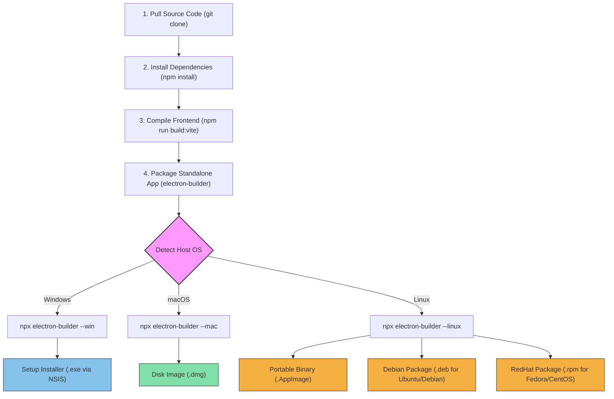

# 🔨 Building ClipMate from Source — Cross-Platform Packaging Guide

This guide provides step-by-step instructions for pulling the **ClipMate** repository and compiling the application natively on your local machine. By following this guide, you can generate production-ready application installers tailored to your operating system: **Windows (`.exe`)**, **macOS (`.dmg`)**, and various **Linux distributions (`.AppImage`, `.deb`, `.rpm`)**.

---

## 📐 Build Pipeline Overview

Before compiling, it helps to understand the two-stage build process of ClipMate:
1. **Vite Build**: Compiles the React frontend application into static assets (`src/renderer/dist`).
2. **Electron Builder**: Bundles the Main process, Preload scripts, and compiled React assets into a standalone native executable.



---

## 📌 Universal Prerequisites

Regardless of your operating system, you must have the following core tools installed:

1. **Git**: Used to clone the code. [Download Git](https://git-scm.com/)
2. **Node.js (v20.x or v22.x LTS)**: The JavaScript runtime environment. [Download Node.js](https://nodejs.org/)
3. **NPM (v10.x+)**: Bundled with Node.js; manages dependencies.

Verify your local installation before starting:
```bash
node --version
npm --version
git --version
```

---

## 🚀 Quick Start (All Platforms)

Open your terminal or command prompt and run the following commands to pull the source code and install project dependencies:

```bash
# 1. Clone the repository
git clone https://github.com/Jewel-cse/clip-mate.git

# 2. Navigate to the project root folder
cd clip-mate

# 3. Install all project dependencies
npm install
```

---

## 💻 OS-Specific Build Instructions

Find your specific operating system below for detailed build pre-requisites and terminal commands.

---

### 🪟 1. Windows

Generates a standalone **NSIS installer (`.exe`)** that guides users through installing the app, creates desktop shortcuts, and registers system startup settings.

#### 🛠️ Prerequisites
* **Windows 10 or 11** (64-bit architecture is targeted by default).
* No additional native compilers are needed for a basic build. However, if native dependencies need recompilation, install the **VS Build Tools**:
  ```powershell
  # Run in PowerShell as Administrator (Optional, only if native builds fail)
  npm install --global --production windows-build-tools
  ```

#### 📦 Build Commands
To compile and package ClipMate on Windows, run:
```bash
# Run the combined build script
npm run build
```
> [!NOTE]
> Alternatively, you can run the sub-steps manually:
> ```bash
> npm run build:vite
> npx electron-builder --win --x64
> ```

#### 🎯 Output Location
Once the build is complete, you will find your installer in the `dist/` directory:
* **`dist/ClipMate Setup 1.0.0.exe`** (Standard NSIS installer)
* **`dist/win-unpacked/`** (Folder containing the raw executable for testing without installing)

---

### 🍎 2. macOS

Generates a standard **Apple Disk Image (`.dmg`)**.

#### 🛠️ Prerequisites
* **macOS 11.0 (Big Sur) or newer**.
* **Xcode Command Line Tools**: Required to compile native Node components. Install them by running:
  ```bash
  xcode-select --install
  ```

#### 📦 Build Commands
To compile and package ClipMate on macOS:
```bash
# Run the combined build script
npm run build
```
> [!NOTE]
> Alternatively, you can run the sub-steps manually:
> ```bash
> npm run build:vite
> npx electron-builder --mac
> ```

#### 🎯 Output Location
The compiled artifacts will be located in the `dist/` directory:
* **`dist/ClipMate-1.0.0.dmg`** (Double-click to drag-and-drop installer)
* **`dist/mac/ClipMate.app`** (Raw application bundle)

> [!WARNING]
> **macOS Gatekeeper Warning:**
> If you distribute a locally built, unsigned `.dmg` file to another Mac, macOS will block it with a *"damaged app"* or *"unidentified developer"* alert. 
> To run your locally built app on a new Mac:
> 1. Double-click the `.dmg` and drag ClipMate to `/Applications`.
> 2. Right-click (or `Ctrl`+click) `ClipMate.app` in your Applications folder and select **Open**.
> 3. Click **Open** on the confirmation prompt to whitelist the app locally.

---

### 🐧 3. Linux (Ubuntu, Debian, Fedora, CentOS, RHEL)

Depending on your distribution, you can build **AppImages**, **Debian packages (`.deb`)**, or **RPM packages (`.rpm`)**.

| Distribution Family | Preferred Installer Format | Required Tool | Install Tool Command |
| :--- | :--- | :--- | :--- |
| **Ubuntu, Debian, Mint** | `.deb`, `.AppImage` | `dpkg`, `fakeroot` | `sudo apt install dpkg fakeroot` |
| **Fedora, CentOS, RHEL** | `.rpm`, `.AppImage` | `rpmbuild` | `sudo dnf install rpm-build` (Fedora)<br>`sudo yum install rpm-build` (CentOS) |
| **Arch, Manjaro** | `.AppImage`, `.pacman` | None (AppImage is self-contained) | N/A |

---

#### 🟥 Section 3A: Ubuntu / Debian / Linux Mint (Debian Family)

##### 🛠️ Native Prerequisites
To generate a `.deb` package, ensure Debian packaging utilities are installed:
```bash
sudo apt update
sudo apt install dpkg fakeroot
```

##### 📦 Build Commands
If you run `npm run build` on Linux, `electron-builder.yml` by default is configured to output an `AppImage`. To override this and build **both** an `AppImage` and a `.deb` package:

```bash
# 1. Compile the React assets first
npm run build:vite

# 2. Package both AppImage and deb targets
npx electron-builder --linux AppImage deb
```

##### 🎯 Output Location
Find your files under `dist/`:
* **`dist/ClipMate-1.0.0.AppImage`** (Portable single-file binary)
* **`dist/clipmate_1.0.0_amd64.deb`** (Debian Installer package)

##### 🚀 How to Install and Run
* **To install the `.deb` package:**
  ```bash
  sudo dpkg -i dist/clipmate_1.0.0_amd64.deb
  # If there are missing dependency errors, resolve them with:
  sudo apt-get install -f
  ```
* **To run the `AppImage` directly:**
  ```bash
  chmod +x dist/ClipMate-1.0.0.AppImage
  ./dist/ClipMate-1.0.0.AppImage
  ```

> [!TIP]
> **FUSE Requirement on Modern Linux:**
> Newer distributions (like Ubuntu 22.04+ or Debian 12+) do not ship with `libfuse2` by default, which is needed to mount and execute AppImages. If your AppImage fails to launch, install FUSE:
> ```bash
> sudo apt install libfuse2
> ```

---

#### 🟦 Section 3B: Fedora / CentOS / RHEL (RedHat Family)

##### 🛠️ Native Prerequisites
To generate a `.rpm` package, install the RPM build tools:
```bash
# Fedora
sudo dnf install rpm-build

# CentOS / RHEL
sudo yum install rpm-build
```

##### 📦 Build Commands
To package both the `AppImage` and `.rpm` targets:

```bash
# 1. Compile Vite frontend
npm run build:vite

# 2. Package AppImage and RPM formats
npx electron-builder --linux AppImage rpm
```

##### 🎯 Output Location
Find your compiled files under `dist/`:
* **`dist/ClipMate-1.0.0.AppImage`** (Portable binary)
* **`dist/clipmate-1.0.0.x86_64.rpm`** (RedHat/Fedora Package)

##### 🚀 How to Install
* **To install the `.rpm` package on Fedora:**
  ```bash
  sudo dnf install dist/clipmate-1.0.0.x86_64.rpm
  ```
* **To install on CentOS:**
  ```bash
  sudo yum localinstall dist/clipmate-1.0.0.x86_64.rpm
  ```

---

## ⚙️ How to Permanentize Targets in Configuration

Instead of specifying formats via CLI arguments every time (e.g., `--linux AppImage deb rpm`), you can permanently update [electron-builder.yml](file:///c:/Users/mdjew/Desktop/rana/desktop-app/clipboard/electron-builder.yml):

```yaml
# Update the linux section in your electron-builder.yml like this:
linux:
  target:
    - AppImage
    - deb
    - rpm
  icon: build/icon.png
```

If you apply this configuration, running `npm run build` on a Linux host machine will compile **all three formats automatically**.

---

## 🛠️ Troubleshooting Local Builds

Here are solutions to common build-time problems when building locally:

### 1. `Error: ELIFECYCLE` or `vite build fails`
* **Cause:** Stale dependencies, incorrect Node version, or cache mismatch.
* **Fix:** Clean your workspace and rebuild:
  ```bash
  # Delete cache folders and lockfiles
  rm -rf node_modules package-lock.json dist src/renderer/dist
  # Re-install clean packages
  npm install
  # Try rebuilding
  npm run build
  ```

### 2. Electron-builder fails downloading Electron binaries
* **Cause:** Network firewalls or slow connections intercepting electron-builder downloads from GitHub.
* **Fix:** Point electron-builder to an alternate mirror:
  ```bash
  # On Linux/macOS
  export ELECTRON_MIRROR="https://npmmirror.com/mirrors/electron/"
  
  # On Windows PowerShell
  $env:ELECTRON_MIRROR="https://npmmirror.com/mirrors/electron/"
  
  # Then run the build command again
  npm run build
  ```

### 3. macOS build fails with `Code signing is required`
* **Cause:** By default, electron-builder tries to sign applications on Mac.
* **Fix:** Force bypass code signing for local, private development builds:
  ```bash
  # Run package script with signing disabled
  CSC_IDENTITY_AUTO_DISCOVERY=false npm run build
  ```

### 4. Linux build fails with `rpmbuild: command not found`
* **Cause:** You tried compiling a `.rpm` package but do not have the compiler tools installed.
* **Fix:** Refer back to [Section 3B](#-section-3b-fedora--centos--rhel-redhat-family) and install `rpm-build` using your package manager.

---

## 🌐 Advanced: Cross-Compilation using Docker

Building installers for all three platforms natively requires access to three physical or virtual machines (Windows for `.exe`, macOS for `.dmg`, Linux for `.deb/.rpm`). 

If you want to package Windows (`.exe`) or Linux (`.deb`/`.rpm`) installers from a different operating system, you can use **Docker**. Electron Builder provides official multi-platform images (`electronuserland/builder`):

```bash
# Run electron-builder inside Docker to compile Windows/Linux packages from macOS/Linux
docker run --rm \
  -v ${PWD}:/project \
  -v ~/.npm:/root/.npm \
  electronuserland/builder:18 \
  /bin/bash -c "npm install && npm run build:vite && npx electron-builder --win --linux"
```
*(Note: Building macOS `.dmg` bundles is strictly limited to macOS environments due to proprietary Apple SDK requirements.)*
